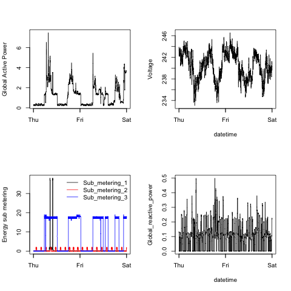

## Exploratory Data Analysis - Assignment 1

This repository contains the solution to the first assignment of 
the Exploratory Data Analysis class: Making Plots with the base R plotting system.
The repository has been created by clonning @rdpeng/ExData_Plotting1.
The original README.md file has been renamed to original.repo.README.md
Following is a brief description of the files contained in the repository:

* **README.md** - this file
* **original.repo.README.md** - the assignment specification (original README.md)
* **plot1.R** ... **plot4.R** - R scripts that generate the plots in the files plot1.png..plot4.png
* **plot1.png** ... **plot4.png** - image files in PNG format containing the required R plots
* **figure** - folder (from the original repository) containing the reference image files for the R plots (in PNG format)

## Data processing in the R scripts

Each "plot**x**.R" script (**x** = 1...4) performs the following tasks:
* read the raw data file ("*household_power_consumprion.txt*") in a data frame
* merge the first two columns - "Date" and "Time" in a single column and convert it from "character" to "POSIXct" type
* discard all the rows in the data frame except those which have the value of the first column ("Date_Time") in the interval [**Feb/01/2007 00:00:00**, **Feb/02/2007 23:59:59**]
* set png(filename="plot**x**.png", bg="transparent") as the current graphics device where **x** is the plot number corresponding to the R script
* generate the required plot using the base R plotting system by calling **hist()**, **plot()** and **lines()** functions (as needed)

Details have been provided in the comments in each R script.
The repository doesn't contain the raw data file (household_power_consumption.txt). If you would 
like to try to run the R scripts, download the scripts from this repository and the raw data file
from the URL provided in the assignment specifications and then source the R scripts in R/RStudio console

#### NOTE:
The image files have been generated with the **same background as the reference plots - transparent** (the alpha-channel of the PNG files is set to 0).
The only **difference** between the images generated by the R scripts and the reference images is the **size of the image**. 
Reference files have **504 x 504** pixels while the files generated by the R scripts have **480 x 480** pixels, as required by the assignment specifications.

Here are the four plots:

### Plot 1

 

### Plot 2

 

### Plot 3

 

### Plot 4

 

